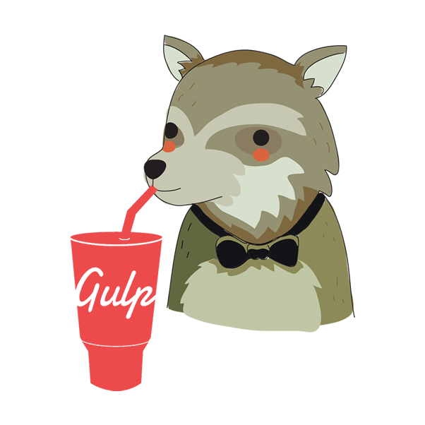

# kEnAi Gulp Starter Kit

* [Inicio](#kenai-gulp-starter-kit)
* [Para comenzar](#para-comenzar)
* [Estructura del kit](#estructura-del-kit)
* [Scripts NPM](#scripts-npm)

Kit de inicio para desarrollo frontend (HTML, Sass y JS) y/o backend (PHP) basado en componentes y automatizado con Gulp desarrollado por [@jonmircha](https://jonmircha.com).

Después de HTML5, los [componentes web](https://www.webcomponents.org/) son el siguiente gran salto en el paradigma del desarrollo web frontend, pero [aun no están listos](http://caniuse.com/#search=components), sin embargo con herramientas como Node, Gulp, Sass, PostCSS, UnCSS, Babel, Browserify, entre algunos otros, podemos desarrollar proyectos con la filosofía de reutilización y componetización que proponen los componentes web, sin necesidad de usar frameworks y librerías robustas como [Angular](https://angular.io/), [React](https://facebook.github.io/react/), [Vue.js](https://vuejs.org/) o [Polymer](https://www.polymer-project.org/).

Además este kit tiene la filosofía de generar un sólo archivo **CSS** gracias a los **imports** de **Sass** y un sólo archivo **JavaScript** gracias a **Browserify**, adicionalmente con **Babel** puedes utilizar todas las características del estándar **EcmaScript** como los módulos (**import** y **export**).

**[:arrow_upper_left: regresar al índice](#kenai-gulp-starter-kit)**

## Para comenzar:

Sólo ejecuta los siguientes comandos:

* **`npm install`** Para instalar todas las dependencias.
* **`npm start`** Para comenzar a trabajar proyecto frontend y backend con PHP.
* **`npm run front`** Para comenzar a trabajar proyecto frontend (sin PHP).

**[:arrow_upper_left: regresar al índice](#kenai-gulp-starter-kit)**

## Estructura del kit:

### Carpetas:

#### :file_folder: ***src***:

Es el directorio donde tendremos los archivos del proyecto en fase de desarrollo, y se estructura de la siguiente manera:

* :file_folder: ***img***: Contendrá las imágenes del proyecto sin optimizar.
* :file_folder: ***js***: Contendrá los archivos JS que serán compilados con **Babel** y unificados con **Browserify**.
  * :file_folder: ***components***: Contendrá los archivos de la programación JS de los componentes.
  * :file_folder: ***helpers***: Contendrá los archivos de la programación JS de códigos auxiliares que no sean componentes, como la conexión a una API, funciones para formatear o filtrar contenido, etc.
  * :page_facing_up: **`index.js`**: Es el archivo principal JS del proyecto, en el que se podrá importar los componentes que se requieran de la carpeta ***components***, ***helpers*** o de las dependencias que se tenga en ***node_modules***.
* :file_folder: ***scss***: Contendrá los archivos **.scss** que compilarán a archivos CSS.
  * :file_folder: ***components***: Contendrá los archivos **partials** de la presentación SCSS o CSS de los componentes.
  * :file_folder: ***helpers***: Contendrá los archivos **partials** **.scss** o **.css** de los estilos auxiliares que no sean parte de un componente, internamente esta carpeta te propone 3 archivos:
    * :page_facing_up: **`reset.scss`**: Es el archivo que contendrá los estilos de reseteo y normalización para todos los navegadores.
    * :page_facing_up: **`utilities.scss`**: Es el archivo que contendrá estilos utilitarios y auxiliares que pueden servir en cualquier componente, elemento de contenido o maquetación.
    * :page_facing_up: **`pages.scss`**: Es el archivo que contendrá los estilos de maquetación de las páginas o secciones del proyecto.
  * :page_facing_up: **`style.scss`**: Es el archivo principal SCSS del proyecto que compilara a CSS, en el que se podrá importar **partials** de las carpetas ***components***, ***helpers*** o de las dependencias que se tenga en ***node_modules***.
* :file_folder: ***app***: Contendrá los archivos **.php** que conformen el proyecto, eres libre de estructurar el contenido dentro de esta carpeta.

#### :file_folder: ***public***:

Es el directorio donde tendremos la versión para publicar del proyecto con todos los archivos HTML y/o PHP generados, lás imágenes optimizadas y archivos estáticos requeridos, así como un sólo archivo CSS llamado **`./css/style.css`** y un sólo archivo JS llamado **`./js/script.js`** que contendrán toda la presentación y programación respectivamente.

### Archivos:

* :page_facing_up: **`package.json`**: Contiene la configuración del proyecto, en el podrás ver todas las dependencias y los scripts NPM programados del kit.
* :page_facing_up: **`.gitignore`**: Indica que archivos y directorios ignorará Git al momento de sincronizar el proyecto, la configuración que se propone ha sido generada en el sitio [gitignore.io](https://www.gitignore.io/) y es esta: [osx,node,macos,linux,windows,visualstudiocode](https://www.gitignore.io/api/osx,node,macos,linux,windows,visualstudiocode) siéntete libre de modificarla a tus necesidades.
* :page_facing_up: **`.editorconfig`**: Contiene la definición de la configuración para mantener la codificación estándar entre diferentes editores e IDEs, considera que en algunos editores tendrás que instalar un plugin adicional para que funcione, consulta el sitio [editorconfig.org](http://editorconfig.org/) para saber si tu editor o ide lo soporta nativamente o requiere algún plugin.
* :page_facing_up: **`.babelrc`**: Contiene la configuración de **`Babel`**.
* :page_facing_up: **`gulpfile.babel.js`**: Contiene la programación JS de las tareas gulp de este kit de inicio con soporte de módulos ECMAScript.
* :page_facing_up: **`README.md`**: Contiene la documentación de este kit.

**[:arrow_upper_left: regresar al índice](#kenai-gulp-starter-kit)**

## Scripts NPM:

Este kit tiene disponible los siguientes comandos para optimizar y automatizar proyectos frontend y backend con PHP, siéntete libre de modificarlos a tus necesidades.

Recuerda que todos los comandos de NPM se corren desde la terminal con **`npm run [nombre del comando]`**

* :heavy_dollar_sign: **`start`**: Levanta un servidor web proxy live reload con Browser Sync para poder compilar archivos PHP, HTML, SCSS y JS con soporte de módulos ECMAScript. El servidor levanta tomando en cuenta la configuración de la variable **`proxyOptions`** del archivo **`gulpfile.babel.js`**.
* :heavy_dollar_sign: **`front`**: : Levanta un servidor web live reload con Browser Sync para poder compilar archivos HTML, SCSS y JS con soporte de módulos ECMAScript. El servidor levanta tomando en cuenta la configuración de la variable **`serverOptions`** del archivo **`gulpfile.babel.js`**.
* :heavy_dollar_sign: **`media`**: Optimiza las imágenes del proyecto y envía los archivos multimedia (png, jpg, jpeg, gif, svg, ico, webp, mp4, mp3) de la carpeta **`./src/img`** a la **`./public/img`**.
* :heavy_dollar_sign: **`uncss`**: Remueve el código CSS innecesario del proyecto, tomando en cuenta la configuración de la variable **`uncssOptions`** del archivo **`gulpfile.babel.js`**.

**[:arrow_upper_left: regresar al índice](#kenai-gulp-starter-kit)**
